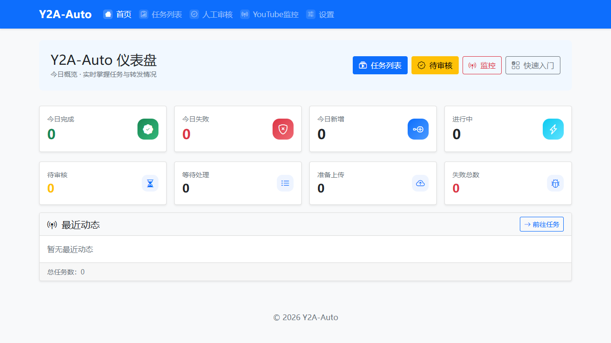
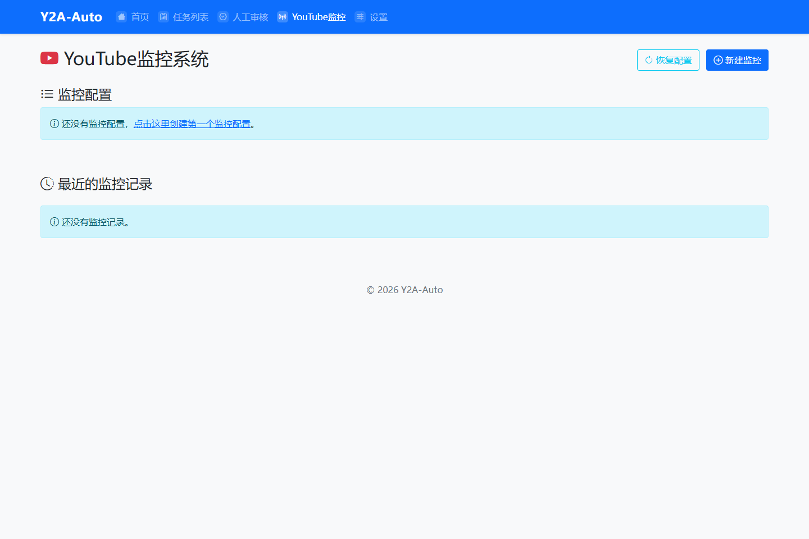
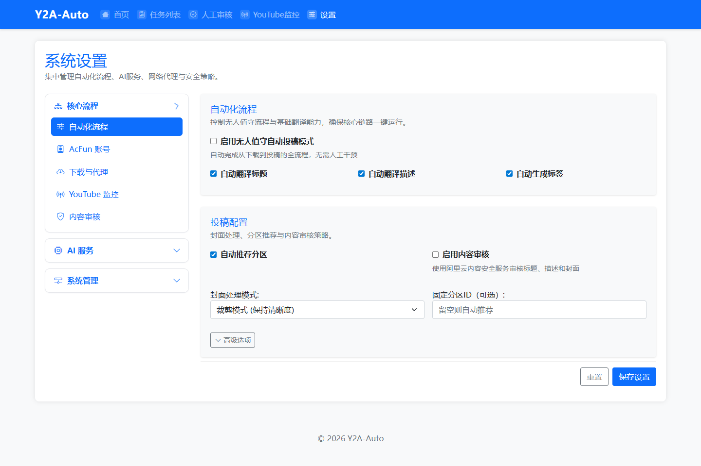

<div align="center">

# Y2A-Auto


将 YouTube 视频自动搬运到 AcFun 的一体化工具。

[](LICENSE)
[](https://www.python.org/)
[](https://www.docker.com/)

从下载、字幕处理、内容审核、AI 增强到上传，全流程自动化；内置 Web 管理后台与 YouTube 监控能力。

[快速开始](#快速开始) · [功能概览](#功能概览) · [部署与运行](#部署与运行) · [配置说明](#配置说明) · [使用指南](#使用指南) · [常见问题](#常见问题)

---

</div>

<p align="center">
  <a href="https://t.me/Y2AAuto_bot" target="_blank">
    
  </a>
  <br/>
  <strong>📢 Telegram 转发机器人（试用）：</strong>
  <a href="https://t.me/Y2AAuto_bot">@Y2AAuto_bot</a>
  <br/>
  <sub>自部署版本：<a href="https://github.com/fqscfqj/Y2A-Auto-tgbot">Y2A-Auto-tgbot</a></sub>
</p>

## 项目展示

<p align="center">
  
</p>

<p align="center">
  
  
</p>

<div align="center">
  <sub>以上为真实页面截图（本地环境采集于 2026-02-16）。</sub>
</div>

## 核心亮点

| 能力模块 | 说明 |
| --- | --- |
| 全流程自动化 | 从下载、字幕、AI 元信息到上传一条龙处理 |
| 审核可控 | 支持人工审核、强制上传与内容安全检测 |
| 灵活部署 | Docker / 本地双模式，支持 CPU 与多种 GPU 编码 |
| 监控拉取 | 支持 YouTube 频道/关键词定时抓取 |

## 功能概览

- 自动化流水线
  - `yt-dlp` 下载视频与封面
  - 字幕下载、AI 翻译、字幕质检（QC，可选）与硬字幕嵌入
  - AI 生成标题、简介、标签与分区推荐
  - 内容安全审核（Aliyun Green）
  - 自动上传到 AcFun
- Web 管理后台
  - 任务列表、人工审核、强制上传
  - 设置中心（自动模式、并发、代理、字幕等）
  - 登录保护与暴力破解锁定
- YouTube 监控
  - 频道/关键词监控（需配置 API Key）
  - 定时抓取与历史记录
- 视频转码
  - 支持 CPU / NVIDIA / Intel / AMD 硬件编码

## 项目结构

```text
Y2A-Auto/
├── app.py
├── requirements.txt
├── Dockerfile
├── docker-compose.yml
├── docker-compose-build.yml
├── Makefile
├── README.md
├── LICENSE
├── acfunid/
├── build-tools/
├── config/
├── cookies/
├── db/
├── downloads/
├── ffmpeg/
├── fonts/
├── logs/
├── modules/
├── static/
├── temp/
└── templates/
```

## 快速开始

推荐使用 Docker（无需手动安装 Python、FFmpeg、yt-dlp）。

1. 准备 Cookie（必须）
- `cookies/yt_cookies.txt`：YouTube 登录 Cookie
- `cookies/ac_cookies.txt`：AcFun 登录 Cookie
- 可使用浏览器扩展导出 `cookies.txt`，请勿提交到仓库

2. 启动服务

```bash
docker compose up -d
```

3. 打开 Web
- 访问 `http://localhost:5000`
- 首次进入建议在设置中开启登录保护并配置密码

默认会持久化目录：`config/`、`db/`、`downloads/`、`logs/`、`temp/`、`cookies/`。

## 部署与运行

### 方案 A：Docker（推荐）

- 启动：`docker compose up -d`
- 停止：`docker compose down`
- 重启：`docker compose restart`
- 日志：`docker compose logs -f`

### 方案 B：本地运行

前置要求：
- Python 3.11+
- FFmpeg
- yt-dlp

```powershell
py -3.11 -m venv .venv
.\.venv\Scripts\Activate.ps1
pip install -r requirements.txt
python app.py
```

访问 `http://127.0.0.1:5000`。

## 配置说明

首次运行会自动生成 `config/config.json`。常用配置项示例：

```json
{
  "AUTO_MODE_ENABLED": true,
  "password_protection_enabled": true,
  "password": "请自行设置",
  "YOUTUBE_COOKIES_PATH": "cookies/yt_cookies.txt",
  "ACFUN_COOKIES_PATH": "cookies/ac_cookies.txt",
  "OPENAI_API_KEY": "",
  "OPENAI_BASE_URL": "https://api.openai.com/v1",
  "OPENAI_MODEL_NAME": "gpt-3.5-turbo",
  "SUBTITLE_TRANSLATION_ENABLED": true,
  "SUBTITLE_TARGET_LANGUAGE": "zh",
  "SUBTITLE_QC_ENABLED": false,
  "SUBTITLE_QC_THRESHOLD": 0.6,
  "SUBTITLE_QC_SAMPLE_MAX_ITEMS": 80,
  "YOUTUBE_API_KEY": "",
  "VIDEO_ENCODER": "auto",
  "VIDEO_CUSTOM_PARAMS_ENABLED": false,
  "VIDEO_CUSTOM_PARAMS": ""
}
```

### 字幕 QC 说明

启用 `SUBTITLE_QC_ENABLED: true` 后，系统会在字幕生成或翻译后进行抽样质检：

- `SUBTITLE_QC_THRESHOLD`：通过阈值（0~1）
- `SUBTITLE_QC_SAMPLE_MAX_ITEMS`：抽样条目上限
- `SUBTITLE_QC_MAX_CHARS`：单次送检最大字符数
- `SUBTITLE_QC_MODEL_NAME`：单独指定 QC 模型（留空则复用翻译模型）

QC 失败时会跳过烧录字幕，但仍保留字幕文件并继续上传原视频，任务最终标记为完成（并显示字幕异常标记）。

## 使用指南

1. 在首页或任务页提交 YouTube 链接创建任务。
2. 自动模式下流程为：下载 -> 字幕处理（可选） -> AI 元信息 -> 审核 -> 上传 AcFun。
3. 在人工审核页可调整标题、简介、标签、分区并强制上传。
4. 启用 YouTube 监控后，可按频道或关键词定时拉取任务。

## FFmpeg 与硬件加速

- 默认优先使用项目内 `ffmpeg/` 目录中的二进制。
- Docker 构建可通过 `FFMPEG_VARIANT` 控制来源（默认 `btbn`）。
- 支持硬件编码器：
  - NVIDIA：`h264_nvenc`
  - Intel：`h264_qsv`
  - AMD（Windows）：`h264_amf`
  - AMD（Linux）：`h264_vaapi`
- 如果硬编不可用，会自动回退到 `libx264`。

### Docker GPU 示例

NVIDIA：

```yaml
gpus: all
environment:
  - NVIDIA_VISIBLE_DEVICES=all
  - NVIDIA_DRIVER_CAPABILITIES=compute,video,utility
runtime: nvidia
```

Intel / AMD（Linux）：

```yaml
devices:
  - /dev/dri:/dev/dri
group_add:
  - video
  - render
```

## 常见问题

- 403 / 需要登录 / not a bot
  - 通常是 YouTube 反爬或权限问题，更新 `cookies/yt_cookies.txt`
- 找不到 FFmpeg / yt-dlp
  - Docker 环境通常无需处理；本地运行请确保 PATH 正确
- 上传 AcFun 失败
  - 更新 `cookies/ac_cookies.txt`，并检查人工审核页元信息是否合规
- 字幕翻译慢
  - 调整并发与批量大小（注意 API 限速）
- Docker 未启用 NVENC
  - 确认 compose 已配置 `gpus: all` 且主机安装 `nvidia-container-toolkit`

## 贡献与反馈

- 欢迎提交 Issue / PR：`../../issues`
- 请勿提交包含 Cookie、密钥等敏感信息的文件

## 致谢

- [acfun_upload](https://github.com/Aruelius/acfun_upload)
- [yt-dlp](https://github.com/yt-dlp/yt-dlp)
- [FFmpeg](https://ffmpeg.org/)
- [Flask](https://flask.palletsprojects.com/)
- [OpenAI](https://openai.com/)

## 许可证

本项目基于 [GNU GPL v3](LICENSE) 开源。请遵守相关平台条款，仅在合法合规前提下用于学习与研究。
